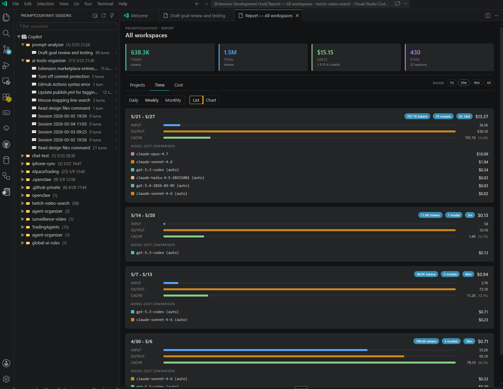

# Promptcountant

> **Note —** This extension was built to understand what costs might look like as GitHub Copilot moves from Premium Requests to AI Credits. It may have less day-to-day value after the June 2026 transition is complete.

See how much your GitHub Copilot chat conversations are costing you — directly inside **VS Code**.

Promptcountant reads GitHub Copilot's on-disk chat history, adds up the tokens you've sent and received per model, and shows the estimated dollar cost for every session, every workspace, and your machine as a whole.



## What it does

Promptcountant adds a sidebar to the Activity Bar with three things:

- **Search box** — type to filter the session list in real time. The filter matches both session names and workspace names.
- **Session tree** — every Copilot chat session you have ever had, grouped by workspace, sorted most-recent-first. Each workspace shows its total estimated cost, and the root Copilot node shows your grand total across all workspaces.
- **Reports** — open a summary scoped to a single session, a single workspace, or everything across your machine. Each report breaks down total tokens and estimated cost per model.
- **Time range filter** — a range selector in the report header (7 days · 30 days · 90 days · All) instantly updates all KPI totals and tab content.
- **Model filtering in Models tab** — use multi-select model chips in the Models tab to compare one model, several models, or all models at once.

Double-click any session to open a detail panel showing each turn: the model used, the duration, tokens sent, tokens received, and the estimated cost for that turn.

## Getting started

1. Install the extension.
2. Open the **Promptcountant** panel from the Activity Bar.
3. The first time it runs, Promptcountant scans every Copilot chat session stored on your machine in the background. Sessions appear in the sidebar as analysis completes — you can start clicking around right away.
4. Click any session to open its detail view, or use the report button to see totals across a workspace.

That's it. There is nothing to configure to get started.

## Key features

**Per-session cost breakdown** — every turn shows the model used, duration, input/output token counts, and the estimated dollar cost using current Copilot pricing.

**Reports at any scope** — see totals for a single session, an entire workspace, or all your activity together. Each report groups results by model so you can tell which models are driving spend. Use the time range selector in the report header to narrow totals to the last 7, 30, or 90 days.

**Accurate token counts when telemetry is enabled** — if you turn on Copilot's debug logging (`github.copilot.chat.agentDebugLog.fileLogging.enabled` in VS Code settings), Promptcountant uses the exact token counts reported by the LLM, including cache-hit totals. Sessions without telemetry still work — they fall back to a character-based estimate.

> **Tip — get precise costs.** Without telemetry, token counts and costs are rough estimates derived from message character length. To capture true tokens and costs for every session going forward, open VS Code settings and enable **`github.copilot.chat.agentDebugLog.fileLogging.enabled`**. Existing sessions that were recorded before telemetry was enabled will continue to show estimates.

**Live pricing with offline fallback** — pricing is pulled from GitHub's public Copilot pricing table once a day. If you're offline, a bundled price list is used so costs still calculate.

**Per-model price overrides** — if you want to model a different rate (custom enterprise pricing, a "what if" comparison, etc.), set `promptcountant.customPrices` in your settings:

```json
"promptcountant.customPrices": {
  "GPT-4o": { "input": 5, "output": 15 }
}
```

Values are USD per 1 million tokens.

**Fast search** — the sidebar filters as you type so you can jump to a session by name.

**Quiet by default** — no popup notifications when things are working. Promptcountant only speaks up when something actually goes wrong.

**Background processing** — large scans run on a worker thread with CPU yielding, so the UI stays responsive even when there are thousands of sessions to crunch through.

## Commands

All commands are available from the Command Palette under the **Promptcountant** category. The most-used commands also appear as icon buttons in the sidebar title bar:

- **Refresh** `$(refresh)` — re-scan for new sessions and turns.
- **Collapse All** `$(collapse-all)` — collapse all workspaces in the sidebar tree.
- **Recompute Costs (Fast)** `$(zap)` — re-apply current pricing to every stored turn without re-parsing the source files. Useful after editing `promptcountant.customPrices` or after the pricing catalog updates.
- **Clear Database & Re-scan All Sessions** `$(sync)` — wipe the local cache and rebuild from scratch. Use this if something looks wrong or you want a completely fresh start. A progress banner appears in the sidebar while the re-scan runs.

## Where the data comes from

Promptcountant reads files that GitHub Copilot already writes to your machine — it does not call any external API for your chat content and does not send your prompts anywhere. The only network call is fetching the public Copilot pricing table from `raw.githubusercontent.com`, cached for 24 hours.

Sessions are collected from **all VS Code variants** installed on your machine. Both the stable **Code** install and **Code - Insiders** are scanned automatically, so activity from either variant appears in the same sidebar.

Your aggregated session data is stored locally in a small SQLite database inside the extension's storage folder.

## Issues & Feedback

Found a bug or have a feature request? [Open an issue on GitHub](https://github.com/smaglio81/promptcountant/issues).
